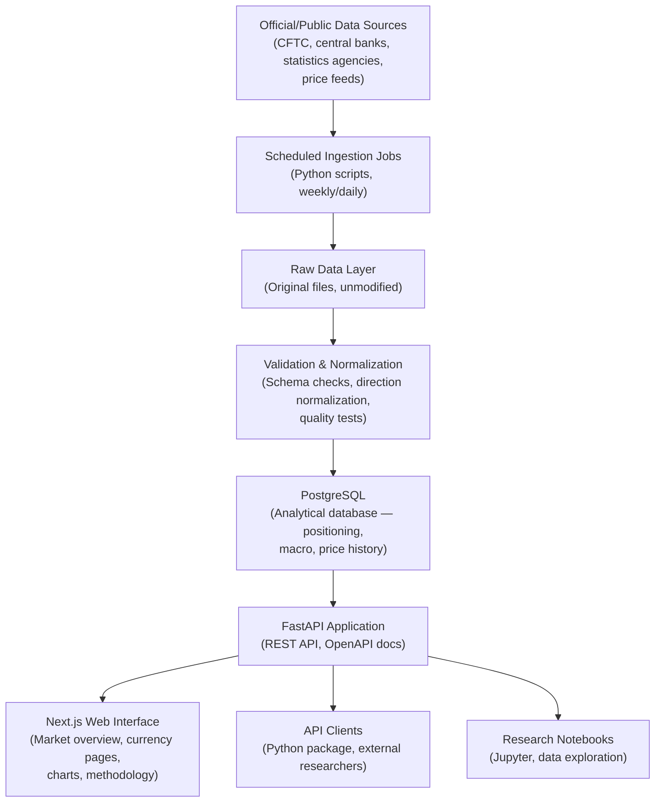

# Architecture

**Status: Proposed architecture — not yet implemented.**

This document describes the planned system architecture for OpenFXLab. The architecture is a proposal and remains open for discussion with technical collaborators.

---

## System overview



---

## Data ingestion

### Scheduling

Ingestion jobs run on a schedule matching the data publication cadence:

- **CFTC TFF reports**: Weekly. Published on Fridays (typically by 3:30pm Eastern Time, based on Tuesday observation data). The ingestion job runs after publication time to fetch and process the latest report.
- **Macro data**: Varies by source. Central bank policy rates may update after scheduled meetings. Inflation and employment data are monthly. Jobs refresh on appropriate schedules.
- **Price data**: Daily (for historical context; no real-time requirement).

### Job structure

Each ingestion job follows the same pattern:
1. Download source file to `raw/` storage (never modified after write)
2. Validate against expected schema
3. Parse and normalize to internal format
4. Run quality checks
5. Write to PostgreSQL
6. Record provenance metadata (source, URL, observation date, publication date, ingestion timestamp)
7. Alert on failure (email or webhook)

---

## Raw versus transformed data

**Raw layer:** Source files exactly as downloaded, stored with timestamps. Never overwritten. Provides auditability and replay capability — if normalization logic changes, raw data can be reprocessed.

**Normalized layer:** Data that has been parsed, cleaned, direction-normalized, and validated. Stored in PostgreSQL in structured tables.

**Analytical layer:** Derived metrics (percentiles, z-scores, differentials) computed from normalized data. May be stored as materialized views or computed on request, depending on query performance.

---

## Currency direction normalization

CFTC positioning data uses the futures contract as the reference. For some pairs, the contract is denominated in the foreign currency versus USD (e.g., EUR futures: long = long EUR/USD). For others, the pair is inverted (e.g., JPY futures: long = long JPY, which is short USD/JPY from the USD perspective).

All positions are normalized to a consistent convention: **positive = long the non-USD currency**. This normalization is documented in a mapping table and applied consistently across all calculations.

---

## Data provenance

Every data point in the database carries:
- `source_id` — reference to the data source registry
- `observation_date` — when the data was observed (e.g., Tuesday for CFTC)
- `publication_date` — when the data was published (e.g., Friday for CFTC)
- `ingested_at` — when the data entered the system
- `source_url` — link to original source where available
- `raw_file_id` — reference to the stored raw file

All of this provenance is exposed through the API and displayed in the web interface.

---

## PostgreSQL schema (proposed)

### `data_sources`
Registry of all data sources with metadata (name, publisher, URL, license, update frequency, coverage description).

### `raw_files`
Record of every downloaded source file (source_id, download_url, file_hash, stored_path, downloaded_at).

### `positioning`
Normalized positioning data: currency, participant_group, report_date, observation_date, gross_long, gross_short, net_position, open_interest, weekly_change, source_id.

### `macro_indicators`
Macro data: currency (or currency_pair for differentials), indicator_type, value, observation_date, source_id.

### `price_history`
OHLCV price data: currency_pair, date, open, high, low, close, volume, source_id.

### `derived_metrics`
Materialized derived metrics: positioning percentiles, z-scores, rate differentials. Refreshed after each ingestion cycle.

---

## FastAPI application layer

### Responsibilities
- Authenticate requests (basic for MVP, key-based in later versions)
- Validate query parameters
- Query PostgreSQL for requested data
- Format responses as JSON with consistent schema
- Return provenance metadata alongside data
- Serve OpenAPI documentation at `/docs`

### Endpoint structure
```
GET /api/v1/currencies
GET /api/v1/positioning/{currency}
GET /api/v1/positioning/{currency}/history
GET /api/v1/macro/{currency}
GET /api/v1/screener
GET /api/v1/download/{currency}/csv
```

---

## Frontend responsibilities

- Fetch data from the API on page load
- Render positioning charts (time series, participant breakdown)
- Display macro panels with latest indicator values
- Render screener table with filter controls
- Display data provenance labels and freshness timestamps
- Link to methodology documentation for every metric
- Provide CSV download links

---

## Error handling

- Ingestion failures: log, alert, and halt — do not write partial data
- API errors: return consistent JSON error responses with HTTP status codes
- Data staleness: API and UI surface warnings when data is older than expected
- Frontend: graceful empty states when data is unavailable

---

## Observability

- Structured logging in all backend components (JSON log format)
- Ingestion job run records (success/failure, records processed, timing)
- API request logging (endpoint, response time, status code)
- Data freshness monitoring (alerts when data is more than N hours stale)
- Future: metrics dashboard (Prometheus/Grafana or hosted equivalent)

---

## Testing

- Unit tests for all data processing functions (Pytest)
- Data validation tests run on every ingestion cycle
- API integration tests covering all endpoints
- Frontend component tests
- End-to-end tests for critical user journeys (later phases)

---

## Security boundaries

- The MVP serves only public, non-sensitive data — no user authentication required for read access
- Admin/ingestion functions protected and not exposed publicly
- Database not directly accessible from the internet
- Input validation via Pydantic on all API endpoints
- Dependencies monitored for known vulnerabilities

---

## Future scalability

The initial architecture is a modular monolith — a single deployable application. This is appropriate for the early scale and team size.

If usage grows significantly, the system can decompose into:
- Separate ingestion service(s)
- Read-replica databases for query-heavy workloads
- CDN for static assets
- Caching layer for frequently requested data

These changes should not be made prematurely.
